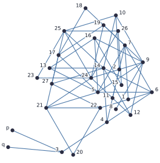
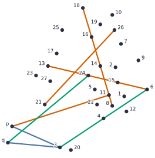

# A unit-distance graph in the plane with independence ratio below 1/4

Supplementary material for the paper [A unit-distance graph in the plane with independence ratio below 1/4](https://arxiv.org/abs/2606.28157) by Ákos Dúcz and Dániel Varga.

We present a unit-distance graph $G_{29}$ in the plane with geometric fractional chromatic number $\chi_{gf}(G_{29}) > 4$. This implies the existence of a unit-distance graph in the plane with independence ratio below $1/4$, settling the second half of [Erdős Problem #1070](https://www.erdosproblems.com/1070): whether every $n$-point set in the plane must contain at least $n/4$ points with no two at distance $1$.

This repository has two main parts. First, it contains a Python verification of the defining
properties of our graph $G_{29}$ and of the rational dual certificate proving
$\chi_{gf}(G_{29}) > 4$. Second, it contains a complete Lean 4 formalization of the theorem and
the corollaries of the paper.

## Python verification

Our graph $G_{29}$ is presented as a list of 29 complex numbers, stored symbolically as SymPy objects. We also provide a Python script to symbolically verify that the graph is indeed a unit-distance graph, and to verify our dual witness, proving a lower bound on $\chi_{gf}(G_{29})$.

The [`snail_reproduction`](snail_reproduction/) directory contains all the material sufficient to verify the claim $\chi_{gf}(G_{29}) > 4$:

- `verts_sym.npy` - a NumPy array containing 29 SymPy objects, our vertices, in the order $\{p,q,v_1,\dots,v_{27}\}$.
- `congruences.txt` - a list of congruences between independent subsets of $G_{29}$.
- `rational_dual.txt` - a dual GFCN LP solution, as rational numbers, certifying $\chi_{gf}(G_{29}) > 4.0007$.
- `verify.py` - a verification script for the supplementary material.
- `utils.py` - utilities for `verify.py`.

Run the verification with:

```sh
python snail_reproduction/verify.py
```

The verification steps in detail:

1. We first load the symbolic vertices, and build an adjacency matrix $A$ using SymPy.
2. We calculate the independent sets of $G_{29}$, also called atoms, from $A$.
3. After loading the congruences, we again use SymPy to verify that each one is indeed an isometry.
4. We build the $C$ matrix from the congruences, which describe our geometric congruence constraints.
5. Finally we load the rational dual solution and verify it using integer arithmetic.

The verification process takes roughly 20 minutes.





## Lean formalization

The [`formalization`](formalization/) directory contains the Lean formalization, forked from [bbeatrix/unit-distance-graph-independence-ratio](https://github.com/bbeatrix/unit-distance-graph-independence-ratio).

Many thanks to Beatrix Benkő for her work on the autoformalization.

<!--
## Planned additions

- TODO The rational witness and the exact GFCN value?
- TODO A PDF will be added later proving an explicit $10^{10^{10^{10^{13}}}}$ upper bound on the size of a unit-distance graph with the required independence ratio below $1/4$.
- TODO Even later, hopefully, an autoformalization of this explicit variant of Theorem 1.
- TODO Okay, but how to update the paper if we add some of these before submission?
- TODO Do not forget to make this repo public, create Zenodo snapshot, and add it to paper bibliography.
-->
